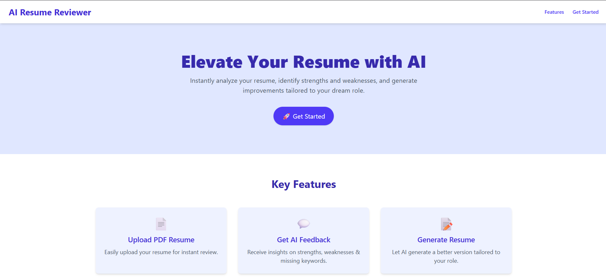
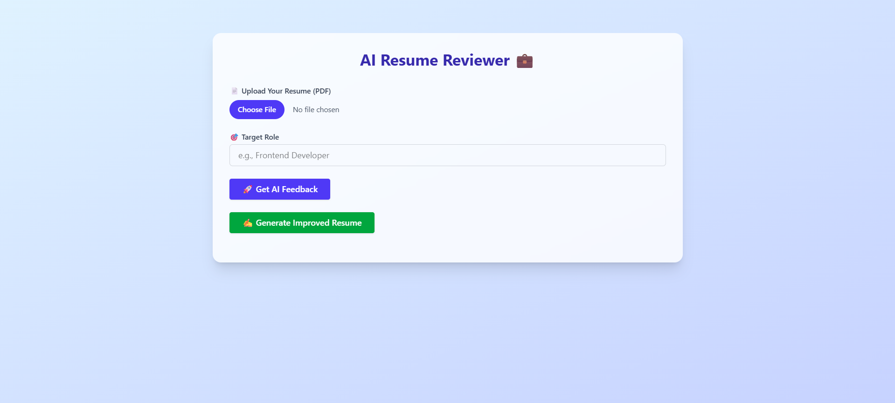
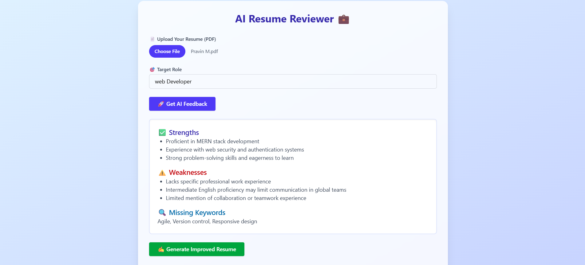
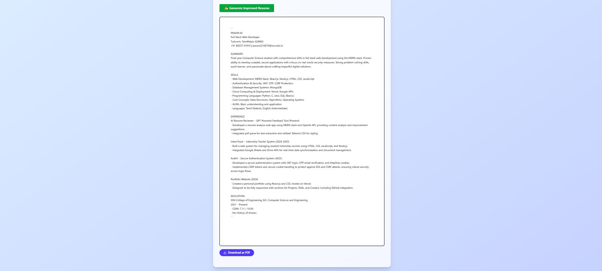

<h2>📸 Screenshots</h2>

<h3>🏠 Landing Page</h3>

This is the clean and minimalistic entry point of the application.

<ul>
  <li>Modern <strong>hero section</strong> with headline and CTA button.</li>
  <li>Professional top navigation.</li>
  <li>Responsive and styled using <code>Tailwind CSS</code> + <code>ShadCN</code>.</li>
</ul>

<h3>📄 Resume Upload & Review</h3>

This screen allows users to upload their resume and specify the target job role.

<ul>
  <li>Resume parsing and AI-based analysis via OpenAI (OpenRouter).</li>
  <li>Form to select role and upload file.</li>
  <li>Simple UI for clear and efficient interaction.</li>
</ul>

<h3>💬 Feedback Panel</h3>

Displays the AI-generated resume feedback including strengths and improvements.

<ul>
  <li>Structured suggestions tailored to the job role.</li>
  <li>Clean card layout using Tailwind and Lucide icons.</li>
  <li>Helps users fine-tune their resume for better job matches.</li>
</ul>

<h3>✍️ Resume Generation</h3>

Provides a clean, ATS-friendly resume generated from user input and feedback.

<ul>
  <li>Two-column layout with sections: Summary, Skills, Experience, Education, etc.</li>
  <li>Option to download the improved resume as a PDF.</li>
  <li>Designed to pass through applicant tracking systems with ease.</li>
</ul>

